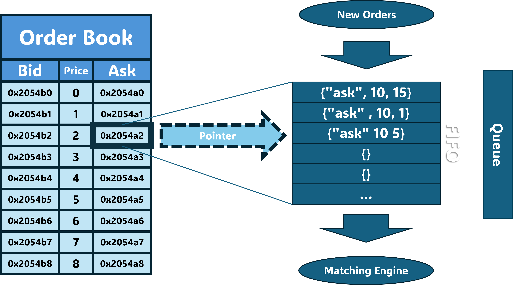

# Go Levine

The project aims to replicate the main function of an exchange: organizing the incoming orders and processing matching orders.



## Bugs

* [ ] If there are no quotes in the ask or bid list the server will crash
  ```
  panic: runtime error: index out of range [0] with length 0

  goroutine 18 [running]:
  Go_net/pkg/common.(*Queue).Observe(...)
          C:/Users/volpi/go/src/Go_Levine/pkg/common/common.go:102
  Go_net/pkg/common.Match({{0xc0000082d0, 0xc0000082e8, 0xc000008300, 0xc000008318, 0xc000008330, 0xc000008348, 0xc000008360, 0xc000008378, 0xc000008390, 0xc0000083a8, ...}, ...})
          C:/Users/volpi/go/src/Go_Levine/pkg/common/common.go:126 +0x1285
  Go_net/pkg/server.engine(0xa4da20, 0xc000062140, 0xa4da40)
          C:/Users/volpi/go/src/Go_Levine/pkg/server/server.go:107 +0x3d8
  created by Go_net/pkg/server.StartServer in goroutine 1
          C:/Users/volpi/go/src/Go_Levine/pkg/server/server.go:66 +0x612
  exit status 2
  ```
